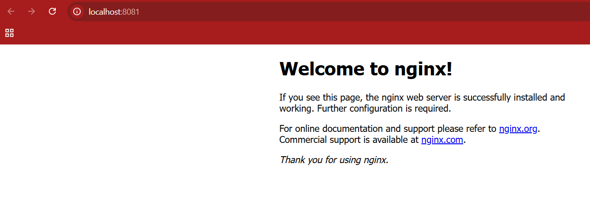

# Task 3: Infrastructure as Code (IaC) using Terraform with Docker

## Objective
Provision a Docker container running NGINX using Terraform as part of a DevOps internship task.

## Tools Used
- Terraform
- Docker

## Steps Performed
1. Wrote a `main.tf` to pull `nginx:latest` and create a container mapping port 80 → 8081.
2. Initialized Terraform using `terraform init`.
3. Verified plan using `terraform plan`.
4. Applied configuration using `terraform apply`.
5. Verified container running by visiting `http://localhost:8081`.
6. Destroyed resources using `terraform destroy`.

## Outcome
Successfully created and destroyed a Docker container using Infrastructure as Code.

## Screenshot

